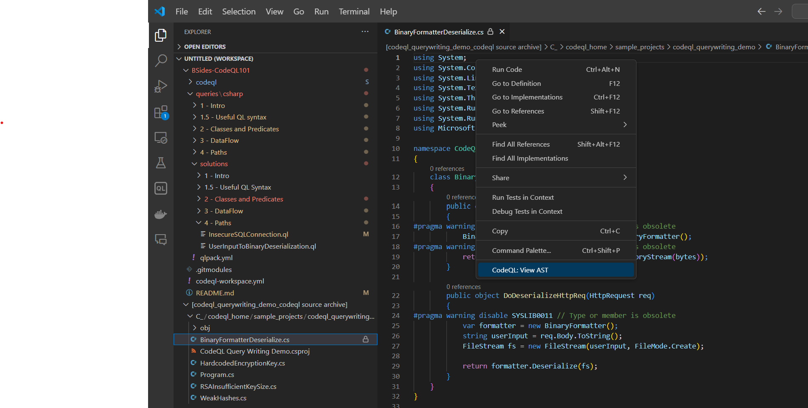

# Intro 

> IMPORTANT: please follow the [Setup Instructions](https://github.com/chanel-y/BSides-CodeQL101/tree/main?tab=readme-ov-file#setup-instructions) before proceeding through the rest of this workshop  

## Add CodeQL Database to VSCode
After you've created a codeql database, open the CodeQL Extension in VSCode. Under Databases, select "From a folder":


And select your codeql database folder. After doing so, it'll appear under the Databases tab.


## Using the AST
Exploring the AST (Abstract Syntax Tree) of your code is a really useful way to see how to translate objects in code to CodeQL. 

Right click on your codeql database in the "Databases" tab of the CodeQL VSCode extension, then select "Add Database Source to Workspace"


Navigate back to File Explorer, and you'll see that the folder containing the source code of the database has been added. Open any of the file, then right click -> "CodeQL: View AST"



This will take a couple seconds to run. Once completed, open the CodeQL extension tab, and the AST will be under "AST Viewer"


**Exercise:** Click around the AST. What are the different CodeQL classes in this program, and what do they correspond with in the source file? How is the AST structured? What child-parent relationships do different objects have? 

**Exercise:** Choose one class in the AST, and find its page in the [CodeQL Csharp Standard Library](https://codeql.github.com/codeql-standard-libraries/csharp/). For example, in the screenshot above of WeakHashes.cs we can see [Class](https://codeql.github.com/codeql-standard-libraries/csharp/semmle/code/csharp/Type.qll/type.Type$Class.html), [Method](https://codeql.github.com/codeql-standard-libraries/csharp/semmle/code/csharp/Callable.qll/type.Callable$Method.html) and [BlockStmt](https://codeql.github.com/codeql-standard-libraries/csharp/semmle/code/csharp/Stmt.qll/type.Stmt$BlockStmt.html). What description, predicates (more on this later), and supertypes does it have? 

## Running your first query
### Structure of a CodeQL Query
Open up Classes.ql. 

CodeQL queries are composed of two parts: metadata, and the query itself

Metadata's pretty self explanatory - this contains information about the query like its name, id, any tags, etc. 
```
/**
 * @name Finds Classes
 * @description Finds Classes
 * @kind problem
 * @precision very-high
 * @id cs/find-classes
 * @problem.severity error
 */
```

The structure of the query itself is very, very similar to SQL queries, where there is a `from`, `where`, and `select`. The select statement should generally select two things: the expression that you're looking for, and the message for the alert. While debugging though, you can select as many things as you want. 

```
from Class c 
select c, "this is a Class"
```

**Exercise:** Modify this query so that it finds all MethodCalls, or all Exprs, or all CommentLines. 

## Writing your first query
In this exercise, we're going to take our first steps to build up to a query to find cases where SHA1 is used. 

In this Intro folder, create a file named "WeakHashSHA1.ql", and copy this starting code: 

```
/**
 * @name Detects use of SHA1
 * @description SHA1 is considered weak and should not be used for cryptographic purposes
 * @kind problem
 * @tags security
 *       external/cwe/cwe-502
 * @precision very-high
 * @id cs/weak-hashes
 * @problem.severity error
 */

import csharp

from <TODO>
where <TODO>
select <TODO>
```

Let's try and select for this case in the WeakHashes.cs file in our sample database: 
```
public byte[] Case1()
{
    SHA1 algorithm = SHA1.Create(); 
    byte[] bytes = Encoding.ASCII.GetBytes("This is a test string");
    byte[] hash = algorithm.ComputeHash(bytes);

    return hash;
}
```
Specifically, the code snippet `SHA1.Create();` , which is what actually creates the SHA1 object. 

Following the steps above, open the AST for this file. 


We can see that in CodeQL, this is a MethodCall. Update the query so that it selects all MethodCalls from our database. Re-run the query, and we can see that SHA1.Create() is among our results. 


This is good progress - next we want to update our query to something like: 
```
from MethodCall mc 
where <mc calls SHA1.Create>
select mc, "this is a MethodCall of SHA1.Create"
```

To figure out how to translate "mc calls SHA1.Create" into ql, we can look into what predicates are available for the MethodCall class in its [entry in the CodeQL standard library](https://codeql.github.com/codeql-standard-libraries/csharp/semmle/code/csharp/exprs/Call.qll/type.Call$MethodCall.html). This list is also reachable in VSCode intellisense:


There's a lot of options here, some intuitive, and some not. If the description isn't clear, we can find out more about each by using them by running the following query:
```
from MethodCall mc 
select mc, mc.getTarget(), mc.toString(), mc.getALocation()
```

**Exercise**: Try playing around with any of the other built-in predicates for MethodCall

Of these, mc.getTarget() is the most promising - from the docs it returns the [Method](https://codeql.github.com/codeql-standard-libraries/csharp/semmle/code/csharp/Callable.qll/type.Callable$Method.html) that the MethodCall... calls. 

We're getting closer. Method has several predicates that have "name" in the name: getName, hasFullyQualifiedName, hasName, and getUndecoratedName. 

Like above, we can select for getName and getUndecoratedName to see what they return. But the other two evaluate to true or false. Instead, we can simply CTRL-F in the codeql/csharp/ql folder of this repository to see how these predicates have been used in other queries written by github. 


Of these options, .hasFullyQualifiedName seems to be our best bet, since it'll let us select for the Create class specifically from the "System.Security.Cryptography.SHA1" library

Putting this all together, our final query is: 

```
from MethodCall mc 
where mc.getTarget().hasFullyQualifiedName("System.Security.Cryptography.SHA1", "Create")
select mc, "this is a call to SHA1.Create()"
```

**Exercise**: Write a query that finds the other way SHA1 is created in this file, specifically the code snippet ` new SHA1CryptoServiceProvider()` 
<details>
<summary>Hint 1</summary>
<br>
Using the AST, what codeql class models the 'new SHA1CryptoServiceProvider'? What are its predicates? </a> 
<br>
</details>
<details>
<summary>Hint 2</summary>
Are there any familiar predicates in the <a href="https://codeql.github.com/codeql-standard-libraries/csharp/semmle/code/csharp/exprs/Creation.qll/type.Creation$ObjectCreation.html">ObjectCreation</a> class? 
</details>

## Further Reading
 - [Metadata for CodeQL queries](https://codeql.github.com/docs/writing-codeql-queries/metadata-for-codeql-queries/)
 - [CodeQL library for C#](https://codeql.github.com/codeql-standard-libraries/csharp/)