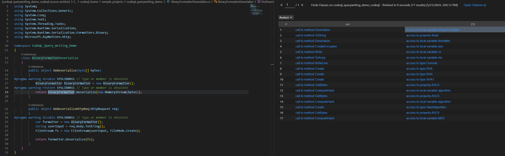

# Useful QL Syntax

## Exists
This is the *most* useful QL syntax. It's sort of used as an equivalent to 'if' in most programming languages. 

It uses the following syntax:
```
exists(<variable declarations> | <formula>)
```

For example, the way to write "This expression is dangerous if it is an argument to MethodCall named Danger" would be: 

```
from Expr e 
where exists(MethodCall mc | 
    mc.getTarget().hasName("Danger") and
    e = mc.getAnArgument()
)
select e
```

## instanceof
This is another useful ql keyword, often used as a way to abstract logic into classes rather than in the query. Like any other result-less predicate, this will evaluate to true or false. 

```
class MyClass(){...}

from Expr e 
where e instanceof MyClass 
select e

```

## casting
Casting is supported in CodeQL using the following syntax: 

```
class MyClass(){...}
class MySubClass(){
    ...
    predicate subClassPredicate(){...}
}

from MyClass myclass 
where myclass.(MySubClass).subClassPredicate()
select myclass
```

**Note:** exists, casting, instanceof, and even the from-where-select in a query are just syntax to do the same thing in different ways. 

Here's an example query that finds all arguments to a MethodCall for a parameter named "password"

```
from MethodCall mc, Expr e
where e = mc.getArgumentForName("password")
select e, "argument with parameter named password"
```

Since the MethodCall is not a part of the select statement, we can hide it behind an exists: 
```
from Expr e
where exists(MethodCall mc | e = mc.getArgumentForName("password"))
select e, "argument with parameter named password"
```

Or we can rewrite this query to use instanceof: 

```
// more on classes in the next section
class PasswordArgToMethodCall extends Expr {
    PasswordArgToMethodCall(){
        exists(MethodCall mc | this = mc.getArgumentForName("password"))
    }
}

from Expr e 
where e instanceof PasswordArgToMethodCall 
select e, "argument with parameter named password"
```

Or we can rewrite it (in a frankly silly way) to use casting instead:
```
// more on classes in the next section
class PasswordArgToMethodCall extends Expr {
    PasswordArgToMethodCall(){
        exists(MethodCall mc | this = mc.getArgumentForName("password"))
    }
}

from Expr e 
select e.(PasswordArgToMethodCall), "argument with parameter named password"
```

All of these are just different syntax to do the similar things. Which to use will depend on how you've structured your query, and ultimately personal preference. 

**Exercise**: like many aspects of codeql, a great way to get familiar with how the above are used is searching through the codeql repository. In the codeql/csharp/ql folder, CTRL-F for: "exists(" , "instanceof", and ".(". How are these used?

## in 
You can check if a value is in a range of values using the "in" keyword, using the syntax: 

`<expression> in <range>`

For example: 

```
class OneTwoThreeFour extends int{
    OneTwoThreeFour(){
        this in [1..4]
    }
}
```

and

```
class SuspiciousVariableName extends string{
    SuspiciousVariableName(){
        this in ["password", "token", "key", "secret"]
    }
}
```

The above is functionally the same as: 

```
class SuspiciousVariableName extends string{
    SuspiciousVariableName(){
        this = "password" or
        this = "token" or
        this = "key" or
        this = "secret"
    }
}
```


## Bonus: Qualifiers
There's a set of classes and predicates such as: QualifiableExpr, hasQualifiedName, getQualifier, etc. that refer to a Qualifier of an object, but in the docs have unuseful explanations like "Holds if this expression is qualified." or "An expression that may have a qualifier."

The most straightforward way to explain this is with an example. Create a new .ql file with the following: 

```
import csharp
from MethodCall mc
select mc, mc.getQualifier()
```

Note: The editor will give the error "A problem query must select a string representing the message as its 2nd result.", but this doesn't matter during the query-writing phase. 

Run the query: 



As you can see, the "qualifier" of the methodcall is the object (if one exists) on which the methodcall is called from. For any Access subclass like PropertyAccess or MemberAccess, it would be the object whose property or member you are accessing.

**Exercise**: Write a query that finds all comments with "TODO". Each of the sample .cs files will have one.
<details>
<summary>Hint 1</summary>
<br>
Open any of the files in the sample project and view its AST using the <a href="https://github.com/chanel-y/BSides-CodeQL101/tree/main/queries/csharp/1%20-%20Intro#using-the-ast">steps from the previous section. </a> What class are we looking for with "all comments with TODO"  ?
<br>
</details>
<details>
<summary>Hint 2</summary>
Look through the predicates available to the <a href="https://codeql.github.com/codeql-standard-libraries/csharp/semmle/code/csharp/Comments.qll/type.Comments$CommentLine.html">CommentLine class</a>. Which might be useful here?
</details>
<details>
<summary>Hint 3</summary>
Look through the predicates available to the built-in <a href="https://codeql.github.com/codeql-standard-libraries/csharp/type.string.html">string class</a>. Which might be useful here?
</details>
<br>

**Exercise**: Write a query that finds all try-catch clauses where the catch block is empty. The sample code for this exercise is in the "EmptyTryCatch.cs" file in the sample project.
<details>
<summary>Hint 1</summary>
<br>
Open the file "EmptyTryCatch.cs" in the sample project and view its AST using the <a href="https://github.com/chanel-y/BSides-CodeQL101/tree/main/queries/csharp/1%20-%20Intro#using-the-ast">steps </a> from the previous section. What codeql class are we targeting here?
<br>
</details>
<details>
<summary>Hint 2</summary>
Look through the predicates available to the <a href="https://codeql.github.com/codeql-standard-libraries/csharp/semmle/code/csharp/Stmt.qll/type.Stmt$CatchClause.html">CatchClause class</a>. Which might be useful here?
</details>
<details>
<summary>Hint 3</summary>
We want to write a query checking if the block of the CatchClause is empty. What predicate in the <a href="https://codeql.github.com/codeql-standard-libraries/csharp/semmle/code/csharp/Stmt.qll/type.Stmt$BlockStmt.html">BlockStmt</a> class would be useful here?
</details>
<br>

## Further Reading
 - [QL Language Reference](https://codeql.github.com/docs/ql-language-reference/)