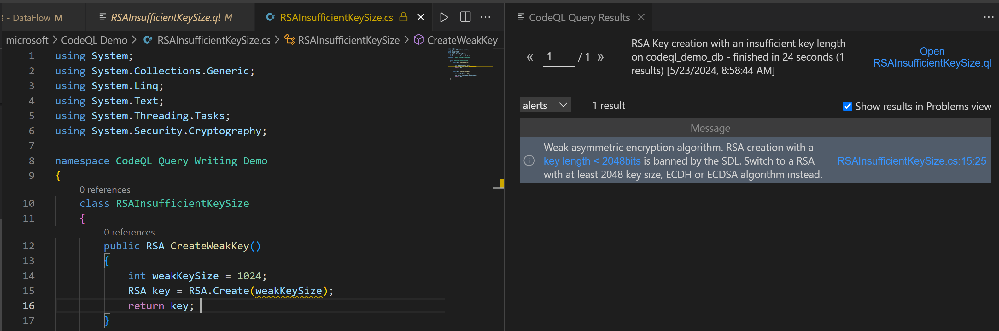

# DataFlow

## Why use Dataflow?
Up until this point, most of the queries we've created can also be done much more easily with other static analysis tools, or even just CTRL-F-ing through a program. But what sets CodeQL apart from these other tools is the ability to write queries that track dataflow throughout a program. 

## How do you use Dataflow?
The syntax for a dataflow query is as follows: 

```
import csharp

module MyFlowConfiguration implements DataFlow::ConfigSig {
  predicate isSource(DataFlow::Node source) {
    ...
  }

  predicate isSink(DataFlow::Node sink) {
    ...
  }
}

module MyFlow = DataFlow::Global<MyFlowConfiguration>;

from DataFlow::Node source, DataFlow::Node sink
where MyFlow::flow(source, sink)
select source, "Dataflow to $@.", sink, sink.toString()
```

When writing a dataflow query, you need to identify your source and sink using the isSource and isSink predicates. For example, your source could be a hardcoded string, or user input. 

A common pattern for dataflow is to define the source and sink as abstract classes, then use the instanceof keyword in the isSource and isSink predicates. For example:

```
abstract class Sink extends Expr {}

module MyFlowConfiguration implements DataFlow::ConfigSig {
  predicate isSource(DataFlow::Node source) {
    source instanceof RemoteFlowSource
  }

  predicate isSink(DataFlow::Node sink) {
    sink instanceof Sink
  }
}

```
## RemoteFlowSource
RemoteFlowSource is a useful built-in class that models user input. You can see more details on what classes are modeled [here](https://github.com/github/codeql/blob/main/csharp/ql/lib/semmle/code/csharp/security/dataflow/flowsources/Remote.qll). Because so many security vulnerabilities stem from user input (eg XSS, SSRF, unsafe Deserialization), this is commonly used as a source in dataflow queries.


## DataFlow vs TaintTracking
By default, dataflow will stop if the data value being tracked is modified at a step. 

For example, dataflow will stop at the second line in the following example: 

```
source = "mysource"
intermediary = source + "something"
mySink(intermediary)
```

If you want to include these steps in your query's dataflow, you'll need to change this line:

```
module MyFlow = DataFlow::Global<MyFlowConfiguration>;
```

to be:

```
module MyFlow = TaintTracking::Global<MyFlowConfiguration>;
```

## In this Exercise

### Starter Code
Let's write a query that checks for cases where you create an [RSA object](https://learn.microsoft.com/en-us/dotnet/api/system.security.cryptography.rsa?view=net-8.0) using a key value of less than 2048 bits, considered the standard key size for a high-strength key (details [here](https://www.ibm.com/docs/en/zos/2.4.0?topic=certificates-size-considerations-public-private-keys)). The sample code for this exercise is in the "RSAInsufficientKeySize.cs" file in the sample project.

First, copy over the following starter code to a file named "RSAInsufficientKeySize.ql". 

```
/**
 * @name RSA Key creation with an insufficient key length
 * @description Finds creation of RSA that explicitly have insufficient key size
 * @kind problem
 * @tags security
 *       external/cwe/cwe-502
 * @precision very-high
 * @id cs/rsa-key-creation-insufficient-key-length-demo
 * @problem.severity error
 */

import csharp

```

### Defining our Source and Sink

As a first step, we need to define our source and sink. In this case, our source will be "any hardcoded integer < 2048", and our sink will be "argument to RSA.Create()"

Using the AST, we can see that our source is an IntLiteral type. If we go to this type's [page in the standard library](https://codeql.github.com/codeql-standard-libraries/csharp/semmle/code/csharp/exprs/Literal.qll/type.Literal$IntLiteral.html), we can see a getValue() predicate, which returns a string. Then, if we go to the string type's [page in the standard library](https://codeql.github.com/codeql-standard-libraries/csharp/type.string.html), we can see a toInt() predicate, which returns an int value for that string. 

Putting this all together, we can run the following query to find our source: 
```
import csharp

from IntLiteral i
where i.getValue().toInt() < 2048
select i, "integer with value < 2048"
```

Next, we need to define our sink. This is an argument to a Methodcall, which is a type we're already familiar with after our SHA1 query. Using the steps from before, we can identify calls to RSA.Create() using the .hasQualifiedName predicate, then use MethodCall's [getArgument](https://codeql.github.com/codeql-standard-libraries/csharp/semmle/code/csharp/exprs/Call.qll/predicate.Call$Call$getArgument.1.html) predicate to get an argument to that call. 

Putting this all together, we can run the following query to find our sink:

```
import csharp

from Expr e 
where exists(MethodCall mc | 
  mc.hasQualifiedName("System.Security.Cryptography.RSA", "Create")
  e = mc.getAnArgument()
)
select e, "argument "

```

### isSource and isSink
Now that we've defined our source and sink, we can start writing our dataflow query. Copy over the codeql dataflow syntax from earlier, and do some renaming so your query looks like the following:  

```
import csharp

module FlowsFromInsufficientSizeToRSACreation implements DataFlow::ConfigSig {
  predicate isSource(DataFlow::Node source) {
    ...
  }

  predicate isSink(DataFlow::Node sink) {
    ...
  }
}

module FlowsFromInsufficientSizeToRSACreationFlow = DataFlow::Global<FlowsFromInsufficientSizeToRSACreation>;

from DataFlow::Node source, DataFlow::Node sink
where FlowsFromInsufficientSizeToRSACreationFlow::flow(source, sink)
select source, "Dataflow from int with value <2048 to create RSA at $@.", sink, sink.toString()
```

All we need to do is populate the isSource and isSink predicates. Both of these predicates have a DataFlow::Node argument which we will be defining by rewriting the queries we wrote before: 

```
predicate isSource(DataFlow::Node source) { source.asExpr().(IntegerLiteral).getValue().toInt() < 2048 }
  
predicate isSink(DataFlow::Node sink) {
  exists(MethodCall mc | 
    mc.getTarget().hasFullyQualifiedName("System.Security.Cryptography.RSA", "Create") and 
    sink.asExpr() = mc.getAnArgument()
  )
}
```

Notice that both predicates use .asExpr() on the source and sink. You'll generally use this predicate in order to interact with the actual object in code that the DataFlow::Node type represents. 

Re-run the final query: 

```
/**
 * @name RSA Key creation with an insufficient key length
 * @description Finds creation of RSA that explicitly have insufficient key size
 * @kind problem
 * @tags security
 *       external/cwe/cwe-502
 * @precision very-high
 * @id cs/rsa-key-creation-insufficient-key-length-demo-solution
 * @problem.severity error
 */

 import csharp

  module FlowsFromInsufficientSizeToRSACreationFlow = DataFlow::Global<FlowsFromInsufficientSizeToRSACreation>;
  
  module FlowsFromInsufficientSizeToRSACreation implements DataFlow::ConfigSig {
    predicate isSource(DataFlow::Node source) { source.asExpr().(IntegerLiteral).getValue().toInt() < 2048 }
  
    predicate isSink(DataFlow::Node sink) {
      exists(MethodCall mc | 
        mc.getTarget().hasFullyQualifiedName("System.Security.Cryptography.RSA", "Create") and 
        sink.asExpr() = mc.getAnArgument()
      )
    }
  }
  
  from
     DataFlow::Node source, DataFlow::Node sink
  where
    FlowsFromInsufficientSizeToRSACreationFlow::flow(source, sink)
select sink, "Weak asymmetric encryption algorithm. RSA creation with a $@ is banned by the SDL. Switch to a RSA with at least 2048 key size, ECDH or ECDSA algorithm instead.",
    source, "key length < 2048bits"
```

And we get our expected result: 




**Exercise**: Write a query that looks for when a hardcoded string is used as the key for an encryption algorithm (see [CWE-321](https://cwe.mitre.org/data/definitions/321.html)). The sample code for this exercise is in the "HardcodedEncryptionKey.cs" file in the sample project.

<details>
<summary>Hint 1</summary>
<br>
Open the file "HardcodedEncryptionKey.cs" in the sample project, and view its AST using the <a href="https://github.com/chanel-y/BSides-CodeQL101/tree/main/queries/csharp/1%20-%20Intro#using-the-ast">steps from the previous section. </a>  What are the sources and sinks for this problem? What are their classes?
<br>
</details>
<details>
<summary>Hint 2</summary>
The source is a hardcoded string, so <a href="https://github.com/chanel-y/BSides-CodeQL101/tree/main/queries/csharp/1.5%20-%20Useful%20QL%20syntax#instanceof">instanceof </a> should be sufficient for defining it. 

There are two sinks. In plain english, how would you describe these? Using <a href="https://github.com/chanel-y/BSides-CodeQL101/tree/main/queries/csharp/1.5%20-%20Useful%20QL%20syntax#exists">exists</a> will help here. 
</details>
<details>
<summary>Hint 3</summary>
In plain english, the sinks are: <br> "the right value of an Assignment where the left side is a PropertyCall with the name Key"<br> and <br>
"The argument named 'rgbkey' to a methodcall to  System.Security.Cryptography.SymmetricAlgorithm.CreateEncryptor"
</details>
<br>

## Further Reading
 - [Analyzing data flow in C#](https://codeql.github.com/docs/codeql-language-guides/analyzing-data-flow-in-csharp/)
