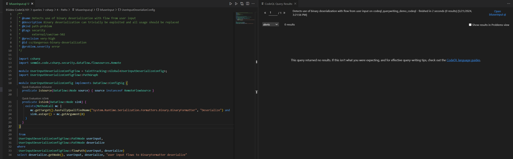
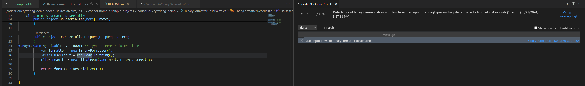
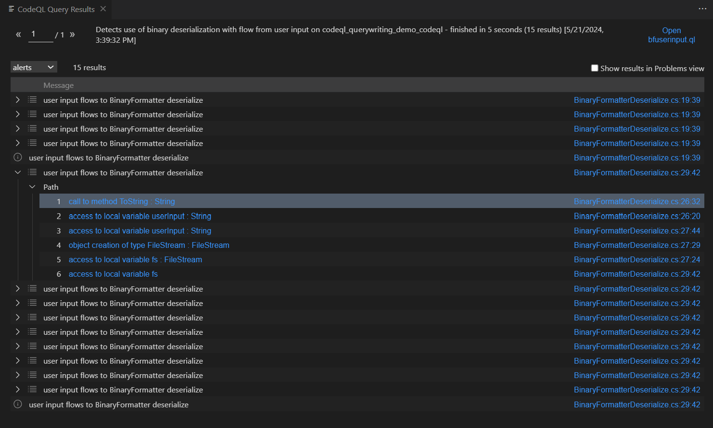
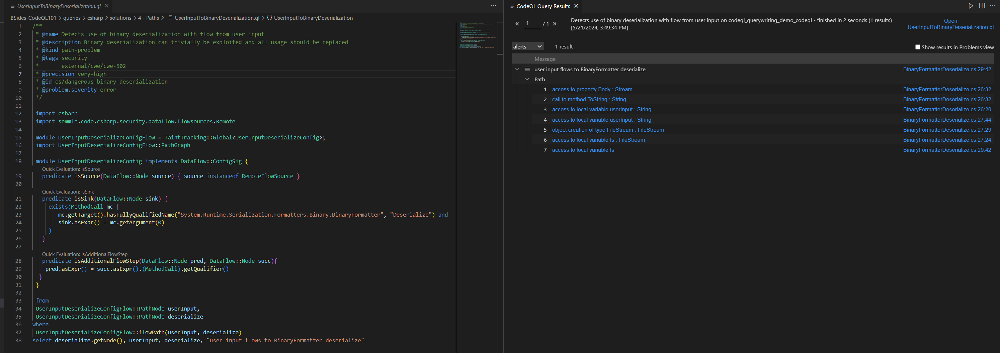

# Paths

## Why use Path Queries? 
Path queries are functionally the same as dataflow queries, but are incredibly useful for debugging during the query-writing process, and for cases when knowing where the dataflow is coming from will be useful for the alert. 

## How to use path queries
This is the syntax for a path-problem query

```
/**
 * ...
 * @kind path-problem
 * ...
 */

import csharp

...

module Flow = DataFlow::Global<MyConfiguration>;
import Flow::PathGraph

from Flow::PathNode source, Flow::PathNode sink
where Flow::flowPath(source, sink)
select sink.getNode(), source, sink, "<message>"
```

## isAdditionalFlowStep
This is an optional predicate you can define in your dataflow in addition to isSource and isSink. You can use it if you want dataflow to go through a step that codeql doesn't currently pass through. 

The syntax for this is as follows: 
```
predicate isAdditionalFlowStep(DataFlow::Node pred, DataFlow::Node succ){
  ...
}
```

In the predicate, you define the additional step by defining the relationship between the two pred and succ dataflow nodes. We'll see an example of this in the following exercise. 

## In this Exercise
Let's write a query that checks for flow from user input to deserialization by the BinaryFormatter class, a vulnerability documented [here](https://learn.microsoft.com/en-us/dotnet/standard/serialization/binaryformatter-security-guide). The sample code for this exercise is in the "BinaryFormatterDeserialize.cs" file in the sample project.

Like any of our previous dataflow queries, we start by defining our source and sink. For this particular query, we can use the existing RemoteFlowSource class since that covers user input. Our sink is an argument to a BinaryFormatter.Deserialize() call. This is very, very similar to our previous RSA insufficient key size sink, just a different method name. 

Putting the above together with our path query syntax, we have the following query: 

```
/**
 * @name Detects use of binary deserialization with flow from user input
 * @description Binary deserialization can trivially be exploited and all usage should be replaced
 * @kind path-problem
 * @tags security
 *       external/cwe/cwe-502
 * @precision very-high
 * @id cs/dangerous-binary-deserialization
 * @problem.severity error
 */

 import csharp
 import semmle.code.csharp.security.dataflow.flowsources.Remote

 module UserInputDeserializeConfigFlow = TaintTracking::Global<UserInputDeserializeConfig>;
 import UserInputDeserializeConfigFlow::PathGraph

 module UserInputDeserializeConfig implements DataFlow::ConfigSig {
   predicate isSource(DataFlow::Node source) { source instanceof RemoteFlowSource }
 
   predicate isSink(DataFlow::Node sink) {
     exists(MethodCall mc |
        mc.getTarget().hasFullyQualifiedName("System.Runtime.Serialization.Formatters.Binary.BinaryFormatter", "Deserialize") and
        sink.asExpr() = mc.getArgument(0)     
     )
   }
 }

 from 
 UserInputDeserializeConfigFlow::PathNode userInput,
 UserInputDeserializeConfigFlow::PathNode deserialize
where 
 UserInputDeserializeConfigFlow::flowPath(userInput, deserialize)
select deserialize.getNode(), userInput, deserialize, "user input flows to BinaryFormatter deserialize"
```

For this query, we're choosing to use TaintTracking, as we are considering user input vulnerable even if the value is modified along the dataflow

But if we run this query as-is... we get no results. 



Let's rewrite this query to see where the dataflow is stopping between our source and sink. Change the isSink predicate to be: 

```
predicate isSink(DataFlow::Node sink) {
  any()
}
```

And re-run the query. We're using the built-in [any()](https://codeql.github.com/docs/ql-language-reference/ql-language-specification/#non-member-built-ins) predicate, which always evaluates to true. By doing so, our query will find any dataflow between our defined source and any dataflow node it reaches.



We have one result, showing that there is flow from our user input `HttpRequest req` to `req.Body` on line 26. 

Do the same steps for source, by changing the isSink predicate back to the original code, then changing the isSource predicate to be:

```
predicate isSource(DataFlow::Node sink) {
  any()
}
```

There's many more results here, but the most interesting result is this one, showing that there is flow from ToString on line 26. 


From our debugging, it seems that dataflow isn't going between the req.Body and the result of toString(). To fix this, we can add the following predicate to our dataflow config: 

```
predicate isAdditionalFlowStep(DataFlow::Node pred, DataFlow::Node succ){
    pred.asExpr() = succ.asExpr().(MethodCall).getQualifier()
  }
```

This predicate tells CodeQL to track dataflow between the pred and succ dataflow nodes. In this case, succ is the toString() methodcall, and pred is the qualifier to that methodcall, req.Body.

Re-run the query with this predicate added, and we've finished writing the query!



**Exercise:** Using the instructions above, convert the RSA Insufficient Key Size and Hardcoded Encryption Key queries into path queries

**Exercise**: Write a path query that looks for cases where encrypt is set to false in a SQL connecion object. The sample code for this exercise is in the "InsecureSqlConnection.cs" file in the sample project.

